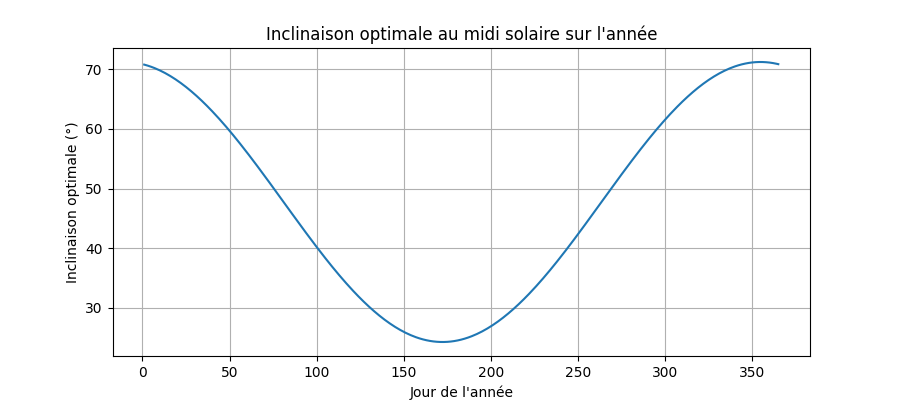
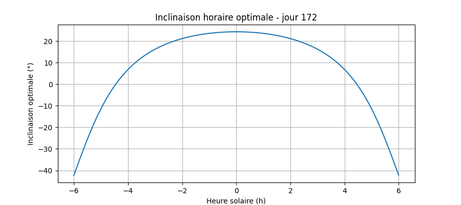

# ☀️ Solar Panel

[Solar Panel](https://elo-world.github.io/solar-panel/) is a website that determines the optimal tilt angle for a solar panel throughout the year.

# 📋 To do

- [ ] A clearer interface.
- [ ] Add the use of more parameters (latitude, time of day, etc.).
- [ ] New illustrations.
- [ ] An animation showing the change in the angle of the solar panel throughout the year and the day.

# 🔍 Theory

You can find the theoretical principle in the Python script: theory.py.
